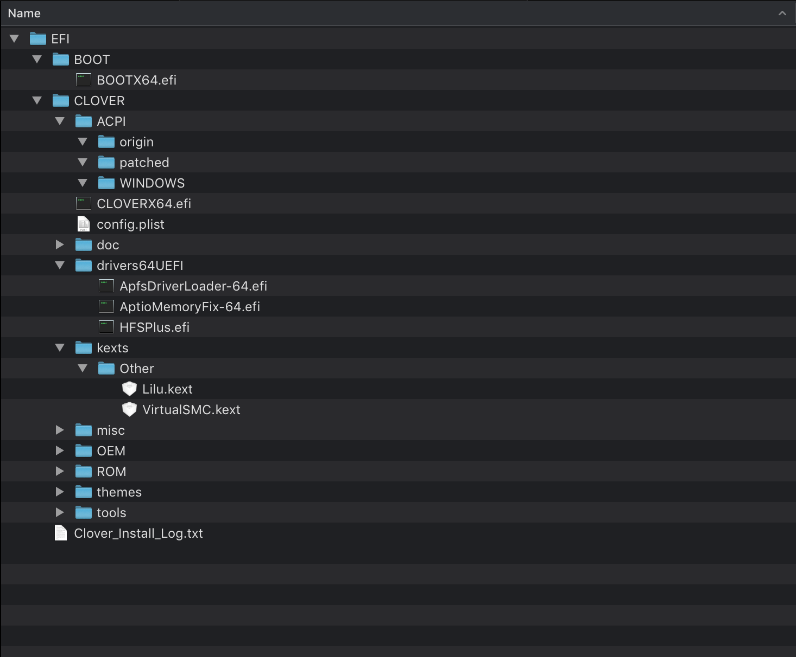

# Minimal Clover Config and Kexts for Gigabyte Z390 I WIFI | 9700K

## Why minimal

There are many tutorial and builds around the hackintosh community, but most of them use a lot of clover config and kexts, and those value/kexts lacks of explaination. I tried to search the meaning of the clover config item, but neither clover wiki nor forum (even golden builds) offer me answers. When someone ask questions in tonymacx or other hackintosh forums, most of time what they get is not an answers, but an EFI.zip. Sometimes an EFI.zip is shortcut to success maybe, but the "blackbox" do not offer any knowleage to solve the problem.

So I want to build my hackintosh with minimal config and kexts, I don't know how they works in detail, but I know what they use for at least.

Correct my if I am wrong, Thanks in advance.

## Parts

- Gigabyte Z390 I WIFI
- Intel i7 9700K
- Corsair LPX DDR4 3000
- Samsung 970Evo 500G for macOS
- Samsung 970Evo 250G for Windows
- Western Digital 2.5' 1TB HDD
- Asus USB-AC53-Nano Wi-Fi Adapter

## Envirenmens

The installation base on vanilla hackintosh tutorial(with excelent explaination) all software/os use the latest version by now(2, March, 2019), but newer versions may works well.

- macOS version: Mojave 10.14.3
- BIOS version: f5d
- CLOVER version: v2.4k r4884

## Pre-Installation

- BIOS setting
  - "Load Optimized Defaults" then "Save and Exit"
  - That's it, everything works fine. it doesn't matter what the values of those options are:
    - Windows 8/10 Features. It's OK with default value "Windows 8/10"
    - CSM Support. It's OK with default value "Enabled""
    - XHCI Hand-off. It's OK with default value "Disabled"
    - Vt-d. It's OK with default value "Enabled"

- Create Installation Media
  - It doesn't matter what usb versions you use. Both USB 2.0 and 3.0 works well.
  - download macOS from Mac App Store
  - follow the vanilla tutorial
    ```bash
    # find usb device number
    diskutils list

    # format usb device, replace # with your usb device number
    diskutil partitionDisk /dev/disk# GPT JHFS+ "USB" 100%

    # create install media
    sudo "/Applications/Install macOS Mojave.app/Contents/Resources/createinstallmedia" --volume /Volumes/USB
    ```

- Install Clover to USB stick
  - install clover, choose usb stick as installation destination
  - click 'Customize' button at left bottom
    - check 'Clover for UEFI booting only'
    - check 'Install Clover in the ESP'
    - under 'UEFI drivers', check 'ApfsDriverLoader-64.efi', 'AptioMemoryFix-64.efi', 'HFSPlus.efi'
    - uncheck others

- Cleanup EFI folder
  - mount EFI folder with Clover Configurator.app
  - delete 'drivers64' folder under 'EFI/CLOVER', we don't need lagency drivers as we boot via UEFI only
  - in 'EFI/CLOVER/drivers64UEFI', 3 drivers: 'ApfsDriverLoader-64.efi', 'AptioMemoryFix-64.efi', 'HFSPlus.efi' are enough, delete others. 'ApfsDriverLoader-64.efi' allow clover to read/write apfs partions, 'AptioMemoryFix-64.efi' for memory management, 'HFSPlus.efi' for reading/writing HFS partions and faster than 'VBoxHfs-64.efi' driver.
  - copy [lilu.kext](https://github.com/acidanthera/Lilu/releases)(download the zip file which has 'RELEASE' in the filename) and [VirtualSMC.kext](https://github.com/acidanthera/VirtualSMC/releases)(download the zip file which has 'RELEASE' in the filename) to 'EFI/CLOVER/kexts/Other' folder. 'VirtualSMC.kext' supercedes FakeSMC.kext as our SMC emulator, it requires 'Lilu.kext' for full functioning. All 'EFI/CLOVER/kexts/10.x.x' folder should be empty or deleted.
  - the final usb stick's EFI folder: 

- Cleanup config.plist
  - open 'EFI/CLOVER/config.plist' by text editor such as 'sublime text','vim' etc. delete all content between `<dict>` and `</dict>`, we will add content later.
  ```xml
  <?xml version="1.0" encoding="UTF-8"?>
  <!DOCTYPE plist PUBLIC "-//Apple//DTD PLIST 1.0//EN" "http://www.apple.com/DTDs/PropertyList-1.0.dtd">
  <plist version="1.0">
  <dict>
  </dict>
  </plist>
  ```
  - `Boot` Section. Add below content to config.plist. `-v` argument will print log to screen, `debug=0x100` will prevent autoreboot when kernel panic, `keepsyms=1` will print symbols on kernel panic. All this 3 arguments help us understand what's going on when booting.
  ```xml
  <key>Boot</key>
  <dict>
      <key>Arguments</key>
      <string>-v debug=0x100 keepsyms=1</string>
  </dict>
  ```
  - `Devices` Section. Must set 'fixOwnership' to true, otherwise we will stuck at 'waiting for booting media'. You can ignore this option if you set your BIOS 'XHCI Hand-off' to 'Enabled'.
  ```xml
  <key>USB</key>
  <dict>
      <key>FixOwnership</key>
      <true/>
  </dict>
  ```
  - `Graphics` Section. When Clover detects an Intel iGPU, it automatically enables Intel Injection if the Graphics section doesn't exist in the config.plist. We don't need injection to make iGPU works, even worse, we can't boot with injection on. To bypass this, we must explicitly disable injection.
  ```xml
  <key>Graphics</key>
  <dict>
      <key>Inject</key>
      <false/>
  </dict>
  ```
  - `KernelAndKextPatches` Section. In order to make all usb port works, we need a patch, otherwise will stuck at 'waiting for boot media' if the port which usb stick plugged in doesn't work.
  ```xml
  <key>KernelAndKextPatches</key>
  <dict>
      <key>KextsToPatch</key>
      <array>
          <dict>
              <key>Comment</key>
              <string>Port limit increase (Ricky)</string>
              <key>Disabled</key>
              <false/>
              <key>Find</key>
              <data>
              g/sPD4OPBAAA
              </data>
              <key>InfoPlistPatch</key>
              <false/>
              <key>MatchOS</key>
              <string>10.14.x</string>
              <key>Name</key>
              <string>com.apple.driver.usb.AppleUSBXHCI</string>
              <key>Replace</key>
              <data>
              g/sPkJCQkJCQ
              </data>
          </dict>
      </array>
  </dict>
  ```
  - `RtVariables` Section. BooterConfig gets set to 0x28, and CsrActiveConfig is set to 0x3e7 which effectively disables SIP.
  ```xml
  <key>RtVariables</key>
  <dict>
      <key>BooterConfig</key>
      <string>0x28</string>
      <key>CsrActiveConfig</key>
      <string>0x3E7</string>
  </dict>
  ```
  - `SMBIOS` Section.
  ```xml
  <key>SMBIOS</key>
  <dict>
      <key>ProductName</key>
      <string>iMac18,1</string>
  </dict>
  ```
  - `SystemParameters` Section. We set `InjectKexts` to Yes to make sure that all the kexts we added before get injected properly.
  ```xml
  <key>SystemParameters</key>
  <dict>
      <key>InjectKexts</key>
      <string>Yes</string>
  </dict>
  ```
  - That's all, final [config.plist](./minimal-usb-stick-config.plist) is simple.

## Installation
## Post-Installation
