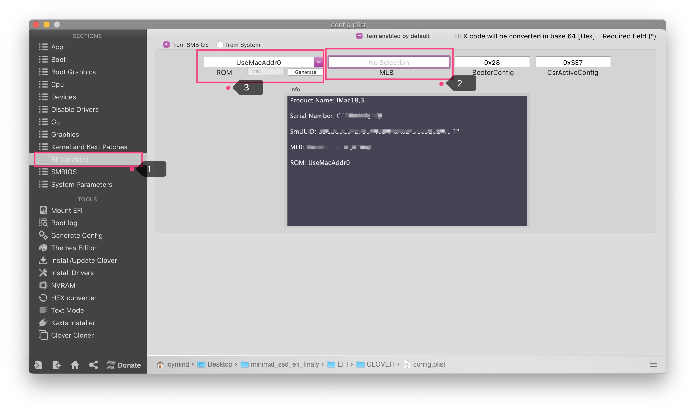

# Post installation: fill SMBIOS info

- open `EFI/CLOVER/config.plist` with Clover Configurator
- generate SMBIOS info with 'iMac18,1', if you use eGPU, select 'iMac18,3' please.
  
  
- Copy `BoardSerialNumber`, paste in `RtVariables`-`MLB`.
- Select 'UseMacAddr0' for `RtVariables`-`ROM`
  
